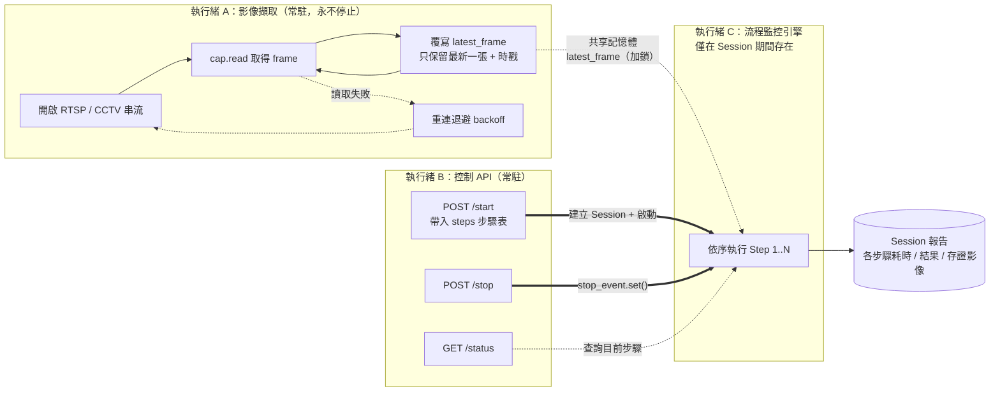
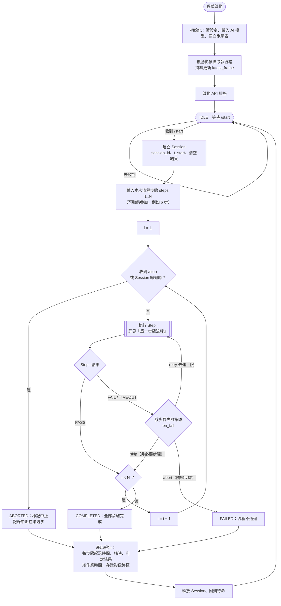
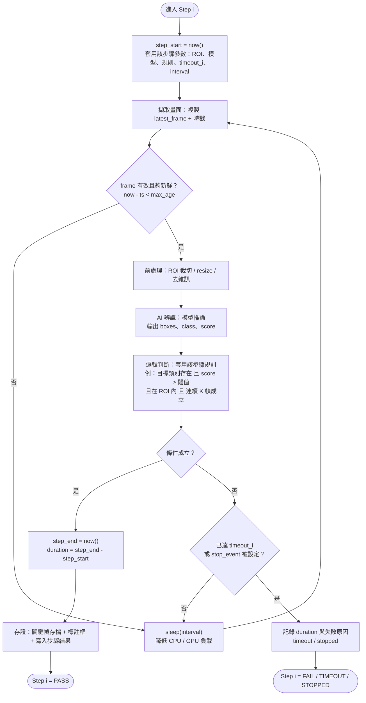
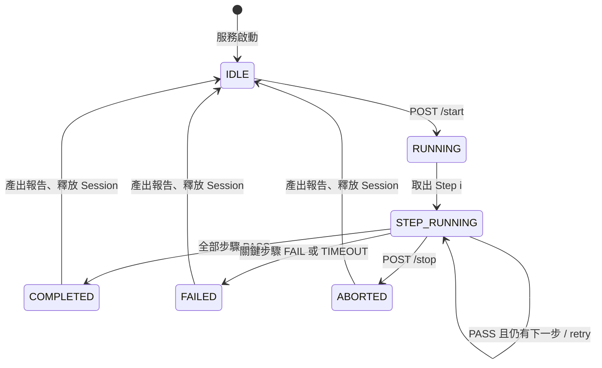
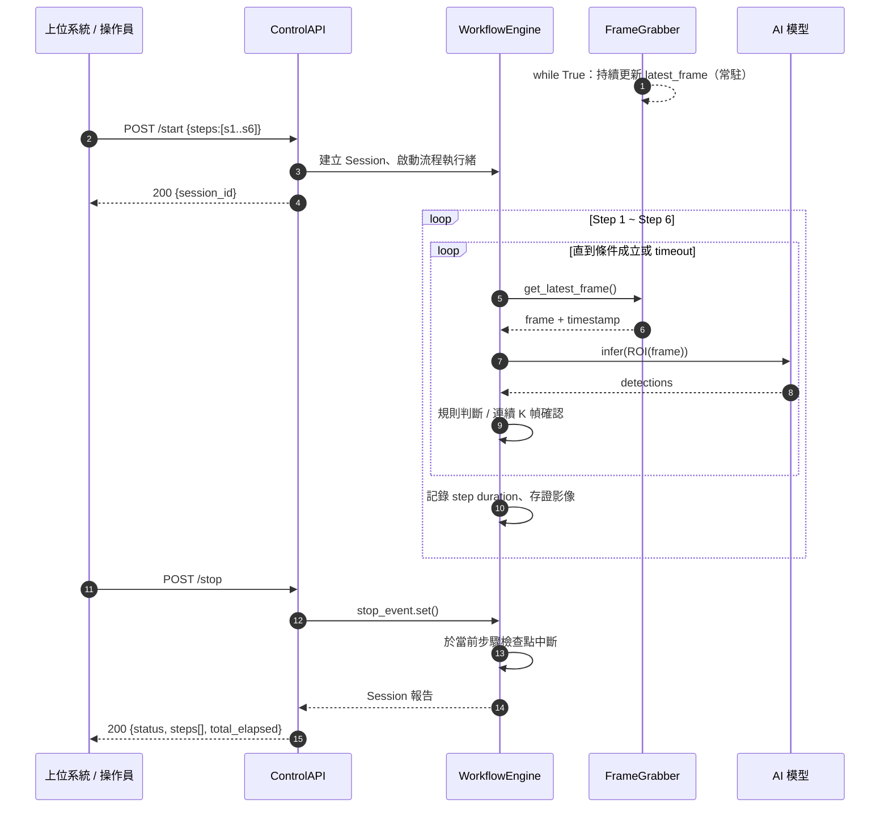

# CCTV 作業流程監控 — 流程圖

主程式：`cctv_monitor/detect.py`（即「cctv 作業流程監控.py」，檔名改用 ASCII 以利 import）

## 0. 設計重點對應

| 需求 | 設計 |
| --- | --- |
| 視頻 loop 持續運行、不斷擷取最新 frame | `FrameGrabber` 常駐執行緒，讀到就覆蓋 `latest_frame`（丟棄舊幀，永遠只留最新一張，避免延遲累積） |
| start / stop 兩支 API，只監控這段期間 | `ControlAPI` 常駐執行緒；`/start` 建立 Session 並啟動流程引擎，`/stop` 設定 `stop_event`；引擎只在 Session 存活期間取用 frame 做辨識 |
| 支援多個動態流程疊加、依序執行 | `steps` 步驟表（可由 `/start` 帶入或設定檔載入），每個 Step = 擷取畫面 → AI 辨識 → 邏輯判斷 → 計時 |

三條執行緒彼此解耦：擷取不受辨識速度拖累，辨識不阻塞 API，`/stop` 能即時中斷。

---

## 1. 系統架構（三個常駐元件）



---

## 2. 主流程圖



> 注意：擷取執行緒 **不隨 /stop 停止**，只有「是否被引擎取用來做辨識」有差別。這樣 `/start` 進來時第一幀就是即時畫面，不需暖機。

---

## 3. 單一步驟流程（Step i 內部）

每個步驟固定四段：擷取畫面 → AI 辨識 → 邏輯判斷 → 執行時間。



---

## 4. Session 狀態機



---

## 5. 時序圖（六步驟為例）



---

## 6. 步驟表格式（動態疊加）

`/start` 可直接帶入，或引用設定檔中預先定義的流程模板：

```json
{
  "workflow_id": "assembly_line_A",
  "session_timeout": 1800,
  "steps": [
    {
      "name": "01_人員就位",
      "roi": [0, 0, 1280, 720],
      "model": "person",
      "rule": {"class": "person", "min_score": 0.6, "min_count": 1, "consecutive": 5},
      "timeout": 120,
      "interval": 0.2,
      "on_fail": "abort"
    },
    { "name": "02_取料", "...": "同上結構" },
    { "name": "03_組裝", "...": "同上結構" },
    { "name": "04_鎖付", "...": "同上結構" },
    { "name": "05_檢查", "...": "同上結構" },
    { "name": "06_入庫", "...": "同上結構" }
  ]
}
```

| 欄位 | 用途 |
| --- | --- |
| `roi` | 該步驟只看畫面的哪一塊，減少誤判與運算量 |
| `model` / `rule` | AI 辨識用哪個模型、判定條件（類別、分數、數量、連續幀數） |
| `timeout` | 該步驟最長等待秒數，逾時即判 FAIL |
| `interval` | 兩次辨識間隔，控制取樣率與 GPU 負載 |
| `on_fail` | `abort`（關鍵步驟）／`skip`（非必要）／`retry`（可重試，含次數上限） |

## 7. 報告輸出

```json
{
  "session_id": "20260902-101533-a1b2",
  "status": "COMPLETED",
  "started_at": "2026-09-02T10:15:33",
  "ended_at": "2026-09-02T10:23:07",
  "total_elapsed": 454.2,
  "steps": [
    {"name": "01_人員就位", "result": "PASS", "elapsed": 12.4, "evidence": "evidence/.../01.jpg"},
    {"name": "02_取料",     "result": "PASS", "elapsed": 63.1, "evidence": "evidence/.../02.jpg"}
  ]
}
```
